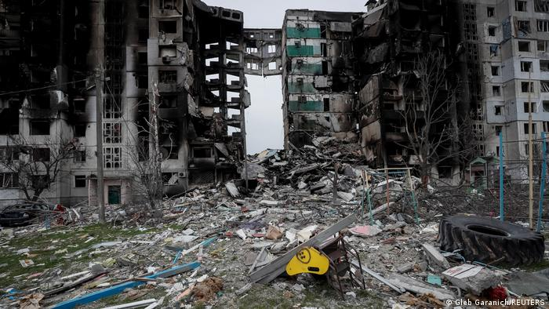

# Center on the Impacts of the War against Ukraine (CIWU)
## The Economic, Social, and Cultural Consequences of the Russian War against Ukraine
### An Interdisciplinary Research Center at [Heidelberg University](https://www.uni-heidelberg.de/en)

[Home](index.md) |

 |

The interdisciplinary center, the Center on the Impacts of the War against Ukraine, brings together scholars studying the economic, social, and cultural consequences of the Russian war against Ukraine. Founded by researchers at the Heidelberg University, its goal is to bring together scholars and humanitarian aid actors with the primary goal of understanding and mitigating the far-reaching consequences of violence and displacement, investigating and laying out paths to a peaceful future in Europe. While the study of Ukraine’s recent history is at the heart of the center, the origins and implications of its recent tragedy shall be studied beyond its borders. CIWU operates as a network for exchange of ideas and initiatives, a place to get inspired and to learn about relevant work as well as to provide support.  

To get connected, please reach out to Alexandra Avdeenko, Bogdan Babych, and Joep Lustenhouwer.

- Economic Consequences of the War in Ukraine: [https://voxeu.org](https://voxeu.org)
